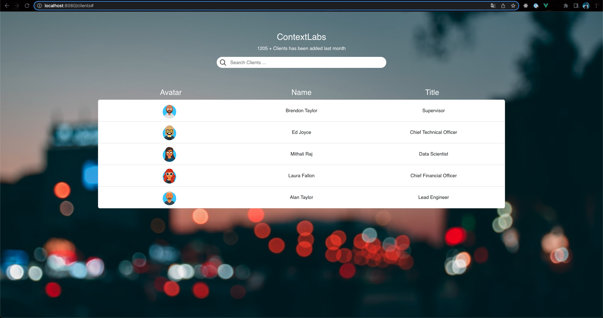
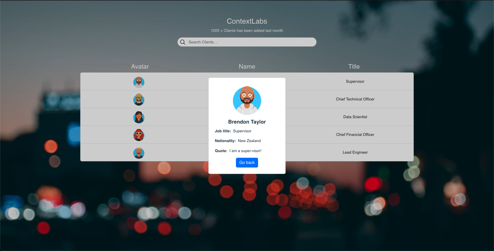
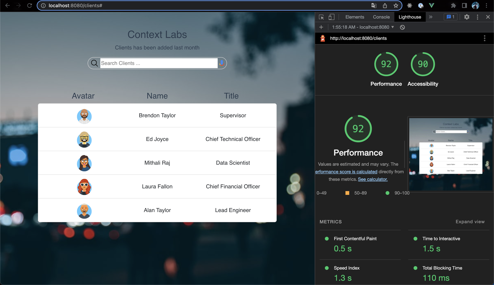
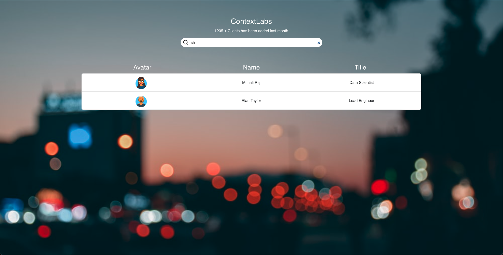
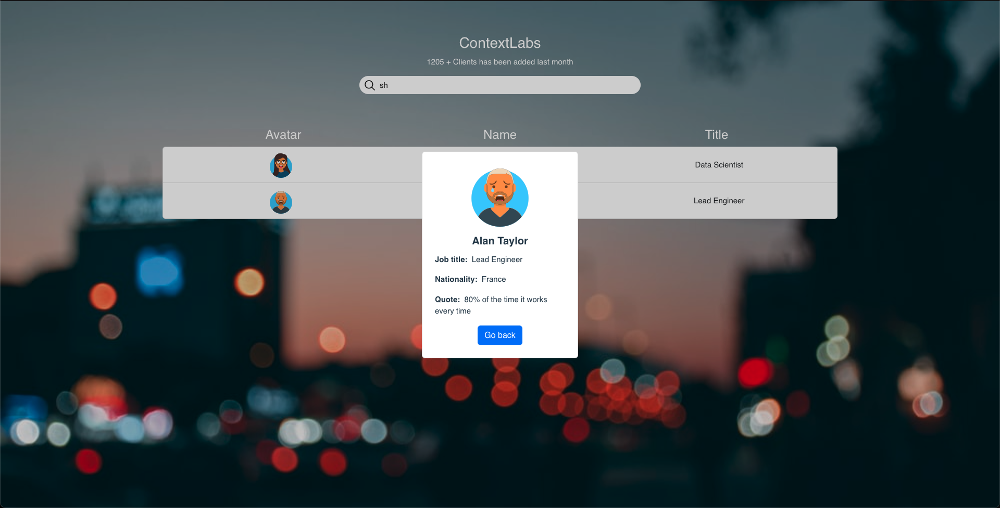
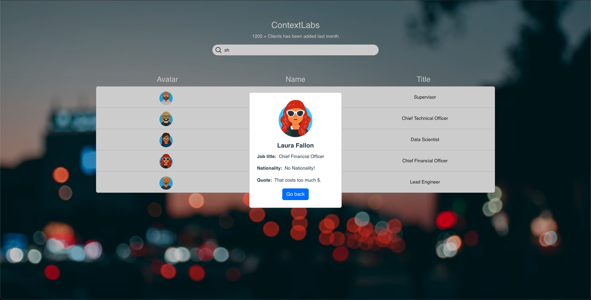

# show-clients-details

- Show Clients Details is a site that hopes to demonstrate how Vue framework works in a real-world context. The site will be targeted users who love to implement more advanced JavaScript concepts.
- Show Clients Details is a fully responsive JavaScript website that will allow users to search for company clients based on all client properties and show clients details.
- Show Clients Details site will show the users:
  - Search Client Input.
  - Clients list.
  - Clients details.

## Project setup

```npm
npm install
```

### Compiles and hot-reloads for development

```console
npm run serve
```

### Compiles and minifies for production

```console
npm run build
```

### Run your unit tests

```console

npm run ut
```

### Lints and fixes files

```console
npm run lint
```

# Navigator

- [**User experience UX**](#user-experience-ux)
  - [User stories](#user-stories)
  - [Site structure](#site-structure)
  - [Design choices](#design-choices)
    - [Typography](#typography)
    - [Color scheme](#color-scheme)
- [**Features**](#features)
  - [Existing features](#existing-features)
    - [Clients List](#clients-list)
    - [Client Details PopUp](#client-details-popup)
    - [Java script functions](#java-script-functions)
  - [Future features](#future-features)
- [**Technologies used**](#technologies-used)
- [**Testing**](#testing)
  - [Code Validation](#code-validation)
  - [Responsiveness Test](#responsiveness-test)
  - [Browser Compatibility](#browser-compatibility)
  - [Lighthouse](#lighthouse)
  - [Manual testing](#manual-testing)
  - [User stories testing](#user-stories-testing)
- [**Deployment**](#deployment)
  - [To fork the repository on GitHub](#to-fork-the-repository-on-github)
  - [To create a local clone of this project](#to-create-a-local-clone-of-this-project)

# User experience (UX)

## User stories

- As a user, I want to be able to See company's clients list onload.
- As a user, I want to understand the purpose of this site upon loading it.
- As a user, I want to be able to search for client using all his details.
- As a user, I want to see updated clients list after search.
- As a user, I want to be able to click on the chosen client.
- As a user, I want to be able to see chosen client details.
- As a user, I want to be able to go back after see the client details popup.

[Back to top](#navigator)

## Site structure

- Show Clients Details site is VueJS-3 one page application rendering multiple components.

[Back to top](#navigator)

## Design choices

### Typography

- The fonts chosen were 'Helvetica' for the body text. It fall back to sans-serif respectively.
- 'Helvetica' is used for the body text as it provides a nice contrast to the site, and it easy to read.

### Color scheme

- Use the color group to get the [contrast-grid](https://contrast-grid.eightshapes.com/).

[Back to top](#navigator)

# Features

## Existing features

### Clients List

- It shows clients list with ability to search.



[Back to top](#navigator)

### Client Details PopUp

- It is card popup show in center of the page.
  

[Back to top](#navigator)

### Java script functions

[Back to top](#navigator)

## Future features

[Back to top](#navigator)

# Technologies used

- [HTML5](https://html.spec.whatwg.org/) - provides the content and structure for the website.
- [SCSS](https://sass-lang.com/) - provides the styling.
- [Bootstrap](https://getbootstrap.com/) - for responsiveness and grid
- [JavaScript](https://developer.mozilla.org/en-US/docs/Web/JavaScript) - provides functions to show users the clients list and make them able to click on the clients and show him client details popup and he can go back to main clients list page.
- [VueJS 3](https://vuejs.org/) - Javascript frontend frame work used to build the app.
- [Jest](https://jestjs.io/) - Unit testing used to test javaScript and vue components and pinia store.
- [@vue/test-utils](https://test-utils.vuejs.org/guide/) - Vue Test Utils is framework agnostic - you can use it with whichever test runner you like. The easiest way to try it out is using Jest, a popular test runner.
- [Pinia Store](https://pinia.vuejs.org/) - Pinia is a store containing vue app states and api hooks. We are using it for better state management.
- [@pinia/testing](https://pinia.vuejs.org/cookbook/testing.html#unit-testing-a-store) - Testing package allow us to createTestingPinia
- [Vue-Cli](https://cli.vuejs.org/) - used to generate vue js app.
- [Visual Studio Code](https://code.visualstudio.com/) - used as code editor.
- [Github](https://github.com/) - used to host and edit the website.

[Back to top](#navigator)

# Testing

## Code Validation

### HTML

- No errors were returned when passing through the official [W3C validator](https://validator.w3.org/)

### SCSS

- No errors were found when passing through the official [W3C validator](https://jigsaw.w3.org/css-validator/)

[Back to top](#navigator)

## Responsiveness Test

- The responsive tests were exercised by using [Google Chrome DevTools](https://developer.chrome.com/docs/devtools/).

|        | iPad mine | Galaxy S5 | iPhone 6/7/8 | iPad | iPad Pro | iPhone 6/7/8 plus | Display >950px |
| ------ | --------- | --------- | ------------ | ---- | -------- | ----------------- | -------------- |
| Text   | pass      | pass      | pass         | pass | pass     | pass              | pass           |
| Images | pass      | pass      | pass         | pass | pass     | pass              | pass           |

[Back to top](#navigator)

## Browser Compatibility

- The Show Clients Details site was tested on the following browsers Google Chrome, Safari and Mozilla Firefox.
- Appearance, functionality and responsiveness were consistent on a range of different device sizes and browsers.

[Back to top](#navigator)

## Lighthouse

The Show Clients Details site was also tested using [Google Lighthouse](https://developers.google.com/web/tools/lighthouse) in Chrome Developer Tools to test the page for:

- Performance - How the page performs whilst loading.
- Accessibility - Is the site accessible for all users and how can it be improved.
- Best Practices - Site conforms to industry best practices.
- SEO - Search engine optimization. Is the site optimized for search engine result rankings.



[Back to top](#navigator)

## Manual testing

- Show search bar.
- Render new Clients list based on the search input.
- Show clients list item in each there avatar, name, job title
  
- Click on clients list item.
- Show Client details pop up: avatar, name , job title, nationality, quote.
  
- Show client details default value if one of the is not in data.
  
- Pop Up avatar size should be 128px.
- Click on go back button or on aside to go back.

[Back to top](#navigator)

## User stories testing

- As a user, I want to understand the purpose of this site upon loading it.

- As a user, I want to know which client is chosen.

  

[Back to top](#navigator)

# Deployment

## To fork the repository on GitHub

A copy of the GitHub Repository can be made by forking the GitHub account. This copy can be viewed and changes can be made to the copy without affecting the original repository. Take the following steps to fork the repository;

1. Log in to **GitHub** and locate the [repository](https://github.com/OmarNizam/show-clients-details).
2. On the right-hand side of the page inline with the repository name, is a button called **'Fork'**. Click on the button to create a copy of the original repository in your GitHub Account.

[Back to top](#navigator)

## To create a local clone of this project

The method for cloning a project from GitHub is below:

1. Under the repository’s name, click on the **code** tab.
2. In the **Clone with HTTPS** section, click on the clipboard icon to copy the given URL.
3. In your IDE of choice, open **Git Bash**.
4. Change the current working directory to where you want the cloned directory to be made.
5. Type **git clone**, then paste the URL copied from GitHub.
6. Press **enter**, and the local clone will be created.

[Back to top](#navigator)
